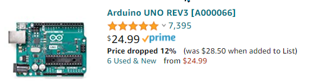
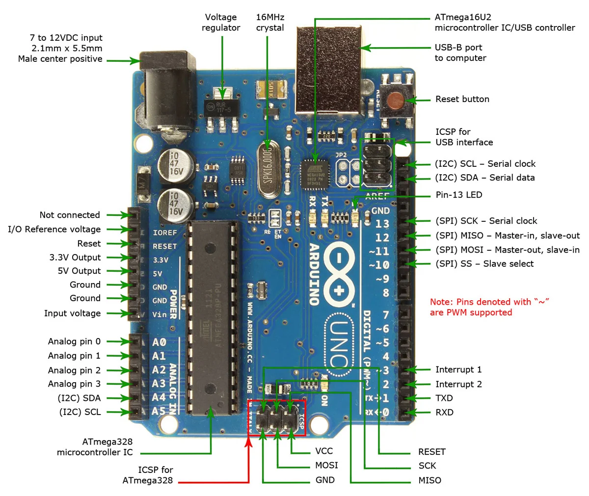
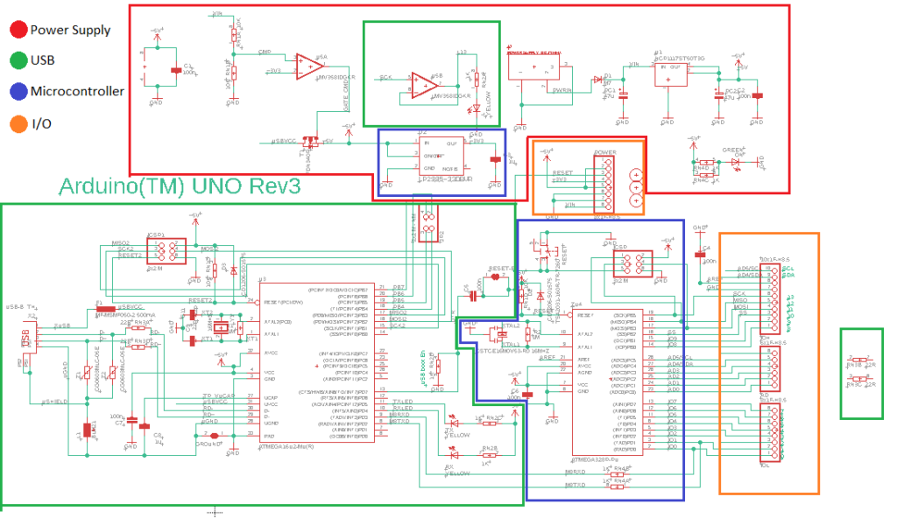
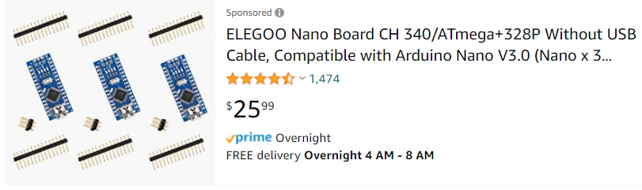
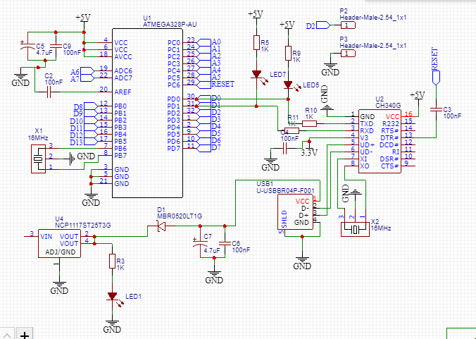
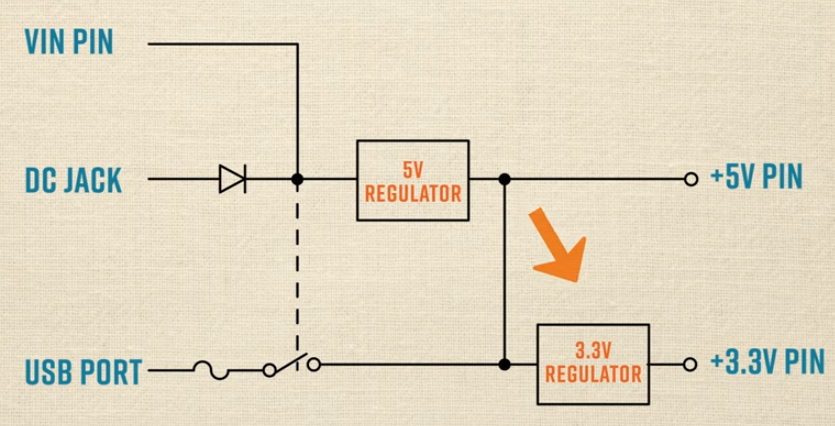
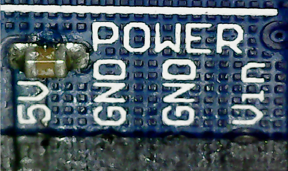
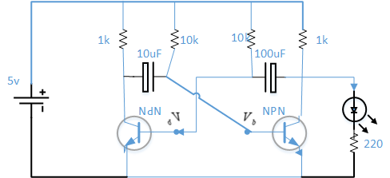

<h1>Arduino Learning Notes</h1>









## 3 way power Arduino
[👍😄Very detail](https://www.youtube.com/watch?v=c03UuefFB3A)



## PIXY2 图像分析
[图像分析，两个马达控制](https://www.youtube.com/watch?v=391dXDjqzXA)

## How to save my amcap.exe snapshot?
> 1. Capture ⟶ Snapshot Location ⟶ Click-OK
> 2. Click [Take a Picture] toolbar icon
> 3. when a window open with the image, click ...
> 4. select Save as..., enter a name 

 
## Getting started
1. buy arduino kit
2. [download software](https://www.arduino.cc/en/software)
    - file: C:\Users\12818\Documents\John\电工\Arduino\arduino-ide_2.0.1_Windows_64bit.exe
3. download and install Arduino IDE
    - hard disk location: C:\Program Files\Arduino IDE
    - executable file: C:\Program Files\Arduino IDE\Arduino IDE.exe
1. test
4. Plug in your Arduino board through USB
5. Start Arduino IDE:
   - 
   - select the com port


## Blink LED on board
* [](Tutorial1/Tutorial1.ino)

🔑💡 **Knowlodge Base**
> Looks like once the program is saved into Arduino, it remembers! remove connection to computer, and plug it back, the program still works.

## Semiconductor


> 1. 电子分布规律：每个电子层最多可容纳的电子数为电子层数的平方的2倍，并且最外层的电子数不超过8。
> 2. 记住，每个子层都有一定的电子容量。它们的电子容量如下：
    s：最多容纳2个电子
    p：最多容纳6个电子
    d：最多容纳10个电子
    f：最多容纳14个电子
> for example: 2, 8, 18, 32, 32, 18, 8

## Blink LED on circuit board
* 
* [2 LED take turn](Tutorial3/Tutorial3.ino)
* [Tutorial 3: 2 LED switched blink](images/tutorial3.MP4)

## AnalogWrite
* [Arduino Tutorial 7: Understanding the Arduino Analog Write Command](https://www.youtube.com/watch?v=6CRhpUV92ww)

## PWM
* [Arduino Tutorial 8: Understanding Pulse Width Modulation (PWM)](https://www.youtube.com/watch?v=YfV-vYT3yfQ)


## 彩色LED

[Color LED source](RGB/RGB.ino)

## Digital Input
two buttons: one turn on LED, one turn off led
[](DigitalInput/DigitalInput.ino)

##  SOS 电报码

* [SOS LED coding](SOS/SOS.ino)
  
## AnalogRead


TXD: Transmitted Data
RXD: Received Data


* [Ohm's Law 分压电阻](analogRead/analogRead.ino)


* [Potentiometer 分压](analogRead/analogRead.ino)


## 电位器调光


* [Dim LED by Potentiometer](DimLED/DimLED.ino)
🔔⚡️ 
> 1. use analog output port such as 9 to send signal to LED;
> 2. use analogWrite() method write out.

## Pull down/up resistor

* [Pull Down resistor](PulldownResistor/PulldownResistor.ino)

## Toggle Button


* [Toggle LED by click button](ToggleLED/ToggleLED.ino)

## Make Sound

* [Make sound by using Buzzer](makeSound/active/active.ino)
* [Passive buzzer make C-D-E-F-G-A-B-C Sound](passive_buzzer/passive_buzzer.ino)
* [](passive_buzzer/pitches/pitches.h)

## Tilt Ball Switch

## Servo Motor

* [Control servo motor](servo/servo.ino)

## DC Motor


* [DC Motor Demo](DC_Motor/DC_Motor.ino)

## IRF520


* [driving code, PWM](IRF520/IRF520.ino)
> ✔️😄 **Solution:**
> 当SIG的输出为100，马达哼鸣，并不旋转，这是由于静摩擦力的作用，当数值超过100，马达开始转动。数值达到最大值255，马达全速转动。两者的区别并不是很大。换言之，速度调节并不明显。这是因为马达供电电压不足5v导致（电流只有140mA）。应该加大供电电压，才能使马达以更快的速度转动。所以当map PWM的占空比时，不需要从0开始。只要从克服静摩擦力开始就可以了。而静摩擦力和车的重量，轴承的润滑程度都有关系。这就是为什么在YouTube的视频教学中，采用了5节电池供电；有的视频采用9v电池供电。9v电池供电速度快了很多，但消耗极大。如果采用两节3.7v的锂铁电池18650，可能效果会好很多。
> 🔥⚡️还有一点要注意的是，供电电源极性不能接反，否则电机将一直转动，忽略信号线的输入。


## Ultrasonic measure distance

* [Ultrasonic measure distance](SR04_Example/SR04_Example.ino)
  
## Two Motors

* [Control 2 motors with distance check](TowMotors/TowMotors.ino)

## Transistor as Switch

* [](TransistorSwitch/TransistorSwitch.ino)
* [](TransistorSwitch_auto/TransistorSwitch_auto.ino)

## NOT-Gate

* [](../Arduino/NOT-Gate/NOT-Gate.ino)

## NAND-Gate


* [](../Arduino/NAND-Gate/NAND-Gate.ino)

🔥⚡️计算机串行输入有延迟，所以必须在三极管基极送出高、低电平后，稍等才能读取集电极的电平信号。
```java
void send(int base1, int base2){
  digitalWrite(base1Pin, base1);
  digitalWrite(base2Pin, base2);
  // int value = digitalRead(collectorPin); 不能在这里，前面的操作尚未完成。
  Serial.print("base1=");
  Serial.print(base1);
  Serial.print("; base2=");
  Serial.print(base2);
  Serial.print("; output=");
  int value = digitalRead(collectorPin); //这里就没有问题了
  Serial.println(value);
  
  delay(500);
}
```
## 无稳态震荡电路


## 编码器
* [编码器 电子元件从零到精通](https://www.youtube.com/watch?v=ujnzk0brDeI)


## 元器件
### 电阻
> 1. 分压
> 2. 限流


压敏电阻，碳膜电阻，

### 电容
[电容的5个作用](https://www.youtube.com/watch?v=QLZ5TQ3G3rs)
[电容的工作原理，隔直流，通交流](https://www.youtube.com/watch?v=eBcnODEt4q8)
1. 分压
2. 分流
3. 耦合
4. 高通
5. 滤波

储能


### 电感Inductance
* [电感的充电和放电](https://www.youtube.com/watch?v=dRAyO0t7ga0)


### 二极管
单向导电

### 三极管
1. 放大
2. 开关

## OPAMP 运算放大器
* [运放-系列视频](https://www.youtube.com/watch?v=SCxHYyCqGuQ&list=RDCMUCKyJK1pPFA6Dxwd31_zFoZQ&index=2)

## MOSFET
* []()

## 从零开始
[C33电子设计从零开始套件](https://www.youtube.com/watch?v=oYEAW6JKq38&list=PLjS7m1WwI7aeKsOO10qUeRC5BLlMijAJt&ab_channel=%E7%94%B5%E8%B7%AF%E9%A3%9E%E7%BF%94)
[光控电路](https://www.youtube.com/watch?v=m6HPeJWW_R4&list=PLjS7m1WwI7aeKsOO10qUeRC5BLlMijAJt&index=12&ab_channel=%E7%94%B5%E8%B7%AF%E9%A3%9E%E7%BF%94)

<<<<<<< HEAD
[Top 5 Useful Electronics Projects use NE555 Timer ic](https://www.youtube.com/watch?v=ZdHsxKY5C7c&ab_channel=ZAFERYILDIZ)
=======

## 双向可控硅
[双向可控硅](https://www.youtube.com/watch?v=dDnrBdBSQNQ&ab_channel=%E7%94%B5%E5%AD%90%E6%8A%80%E6%9C%AF)

>>>>>>> 454fc559ab0e9750ad83764896b4d0c77bdc3c8e
### Arduino UNO


### Arduino NANO


### 示波器
* [示波器测量开关电源](https://www.youtube.com/watch?v=uSTa-e5N1tY)

## 简单直流升压电路
 [简单直流升压电路](https://www.youtube.com/watch?v=R9hT61IMgII&ab_channel=%E9%A3%9E%E5%A4%9A)

## Reference
* [DroneBot Workshop website](https://dronebotworkshop.com/)
* [YouTube Arduino Tutorial 1](https://www.youtube.com/watch?v=fJWR7dBuc18&t=46s)
* [15 Brilliant Arduino projects](https://www.youtube.com/watch?v=173sWk44wjg&t=516s)
* [TOP 10 Arduino projects of 2020](https://www.youtube.com/watch?v=ydgLQCQMBuU&list=TLPQMDExMTIwMjLeHYw27B7A5w&index=2)
* [LED 7 segament display](https://www.youtube.com/watch?v=6XY9PooMrms)
* [](https://www.youtube.com/watch?v=6XY9PooMrms)
* [Transistor with arduino](https://www.youtube.com/watch?v=IG5vw6P9iY4)
* [How to use MOSFET as a Switch ](https://www.youtube.com/watch?v=UJkHL-6mn8s)
* [How an NPN Transistor Works as a Switch](https://www.youtube.com/watch?v=WRm2oUw4owE)
* [三极管](translator: [https://www.youtube.com/watch?v=Cbvvk9sKTs8](https://www.youtube.com/watch?v=Cbvvk9sKTs8))

[手工制作印刷电路板：]([https://www.youtube.com/watch?v=-guLpzvVVC4](https://www.youtube.com/watch?v=-guLpzvVVC4))

[三极管功能的解释}([https://www.youtube.com/watch?v=dpUAecLQNnw](https://www.youtube.com/watch?v=dpUAecLQNnw))

[MOS场效应管的工作原理]([https://www.youtube.com/watch?v=HtE6inJg2XQ](https://www.youtube.com/watch?v=HtE6inJg2XQ))

 [Metal  Oxide Semiconductor Field Effect Transistor]([https://www.youtube.com/watch?v=Bfvyj88Hs_o](https://www.youtube.com/watch?v=Bfvyj88Hs_o))

[👍😄MOSFET原理]([https://www.youtube.com/watch?v=rkbjHNEKcRw](https://www.youtube.com/watch?v=rkbjHNEKcRw))

[**MOSFET Driver Part 1**]([https://www.youtube.com/watch?v=8swJ_Bnsgl4](https://www.youtube.com/watch?v=8swJ_Bnsgl4))

[**MOSFET Driver Part 1**]([https://www.youtube.com/watch?v=B7Eqrf2M-Iw](https://www.youtube.com/watch?v=B7Eqrf2M-Iw))

[电容的工作原理]([https://www.youtube.com/watch?v=AVoI6pPY_HA](https://www.youtube.com/watch?v=AVoI6pPY_HA))

[电阻的工作原理]([https://www.youtube.com/watch?v=JMT8huUd11Y](https://www.youtube.com/watch?v=JMT8huUd11Y))

[电感器工作原理]([https://www.youtube.com/watch?v=DIoLfzlB3Rs](https://www.youtube.com/watch?v=DIoLfzlB3Rs))

[变压器工作原理]([https://www.youtube.com/watch?v=GUACug_uNWU](https://www.youtube.com/watch?v=GUACug_uNWU))

[步进马达原理]([https://www.youtube.com/watch?v=tBVAgzF1ekw](https://www.youtube.com/watch?v=tBVAgzF1ekw))

[单项马达旋转原理]([https://www.youtube.com/watch?v=__nS3OelY-s&list=RDCMUCckETVOT59aYw80B36aP9vw&start_radio=1&rv=__nS3OelY-s&t=72](https://www.youtube.com/watch?v=__nS3OelY-s&list=RDCMUCckETVOT59aYw80B36aP9vw&start_radio=1&rv=__nS3OelY-s&t=72))

[直流马达旋转原理]([https://www.youtube.com/watch?v=-qS85aIvleQ&list=RDCMUCckETVOT59aYw80B36aP9vw&index=2](https://www.youtube.com/watch?v=-qS85aIvleQ&list=RDCMUCckETVOT59aYw80B36aP9vw&index=2))

[https://www.youtube.com/watch?v=8swJ_Bnsgl4](https://www.youtube.com/watch?v=8swJ_Bnsgl4)

[机器车]([https://www.youtube.com/watch?v=oQQpAACa3ac](https://www.youtube.com/watch?v=oQQpAACa3ac))

**开关电源概念和原理**[https://www.youtube.com/watch?v=OLXI_AUpPxk](https://www.youtube.com/watch?v=OLXI_AUpPxk)

**开关电源维修第一步，学会跑电路是关键**[https://www.youtube.com/watch?v=gpwvyF1bdCg](https://www.youtube.com/watch?v=gpwvyF1bdCg)

[https://www.youtube.com/watch?v=izW1X2555Wg](https://www.youtube.com/watch?v=izW1X2555Wg)

三极管arduino功率应用 [https://www.youtube.com/watch?v=jvlTKi9nMO0](https://www.youtube.com/watch?v=jvlTKi9nMO0)

非常详细的计算和实践[https://www.youtube.com/watch?v=WRm2oUw4owE](https://www.youtube.com/watch?v=WRm2oUw4owE)

TIP120 控制大电流用电器[https://www.youtube.com/watch?v=IG5vw6P9iY4&t=69s](https://www.youtube.com/watch?v=IG5vw6P9iY4&t=69s)

NE555P[https://www.youtube.com/watch?v=ABWU7FlM1T0](https://www.youtube.com/watch?v=ABWU7FlM1T0)

直流马达速度控制[https://www.youtube.com/watch?v=ABWU7FlM1T0](https://www.youtube.com/watch?v=ABWU7FlM1T0)

[直流马达速度控制]([https://dronebotworkshop.com/dc-gearmotors-pwm/](https://dronebotworkshop.com/dc-gearmotors-pwm/))

**Spot Welder for 18650 Lithium Ion Battery**
 [https://www.youtube.com/watch?v=QldSD81nY4c](https://www.youtube.com/watch?v=QldSD81nY4c)

**Spot Welder for 18650 Lithium Ion Battery from microwave transformer**
[https://www.youtube.com/watch?v=TI_ZV-5WHi4&list=TLPQMDYxMTIwMjLQXBBQGCy0Cg&index=3](https://www.youtube.com/watch?v=TI_ZV-5WHi4&list=TLPQMDYxMTIwMjLQXBBQGCy0Cg&index=3)

非常好的想法，使用car jumper制作spot welder [https://www.youtube.com/watch?v=Hj8rmWS5iqE](https://www.youtube.com/watch?v=Hj8rmWS5iqE)

[DUMMY ROBOTIC ARM from scratch](https://www.youtube.com/watch?v=F29vrvUwqS4&ab_channel=%E7%A8%9A%E6%99%96%E5%90%9B)
[LED Displays with Arduino - 7-Segment & Dot-Matrix](https://www.youtube.com/watch?v=6XY9PooMrms&ab_channel=DroneBotWorkshop)
[](https://www.youtube.com/watch?v=9Zwq_nTTp7U&ab_channel=KendinYap)
[伺服电机起重机](https://www.youtube.com/watch?v=B2lwaLmHDEI&ab_channel=RobotUNO)
[How Do Computers Remember?](https://www.youtube.com/watch?v=I0-izyq6q5s&ab_channel=SebastianLague)


## TODO LIST
* ~~blink~~
* ~~LED~~
* ~~RGB LED~~ Not what you expected colors.
* ~~Digital Input~~
* ~~Active Buzzer~~
* ~~Passive Buzzer~~
* ~~Tilt Ball Switch~~